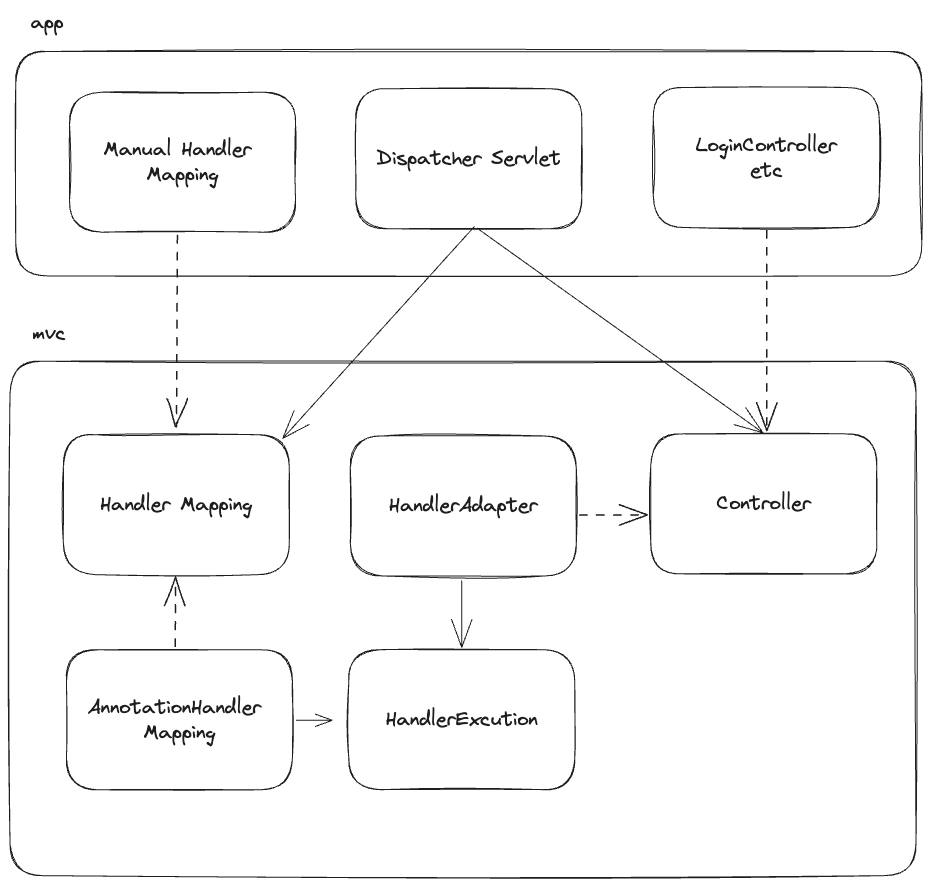

# @MVC 구현하기

## 기능 요구 사항

### 1 단계 : @MVC Framework

- [x] AnnotationHandlerMappingTest 성공하기
  - [x] Map<HandlerKey, HandlerExecution> handlerExecutions 에 TestController 메서드 추가하기
  - [x] HandlerExecution 에서 method.invoke() 호출

### 2 단계 : Legacy MVC와 @MVC 통합

- [x] HandlerMapping 추가
  - [x] AnnotationHandlerMapping, ManualHandlerMapping 추상화
  - [x] DispatcherServlet 의존성 변경

- [x] Adaptor 추가
  - [x] Controller, HandlerExecution 연결

고민 혹은 궁금증
- HandlerExecution, Controller 의 반환 타입이 다르다.
  - Controller 의 반환 타입을 Object로 바꿔도 되는가?
  - 이미 배포된 Interface라면, 바꾸면 안 되는 것 아닌가?
  - 바꿔도 상관없다. Object니까. 최고 조상 클래스!
  - Controller 가 Object를 반환하는 것만으로 추상화가 충분히 되었는가?
    - 다른 녀석이 Controller 가 반환하는 String을 ModelAndView로 바꿔주면 어떨까. 추상화가 훨씬 많이 될 것이다.

- DispatcherServlet 에게 HandlerMapping 을 누가 건네주는가?
