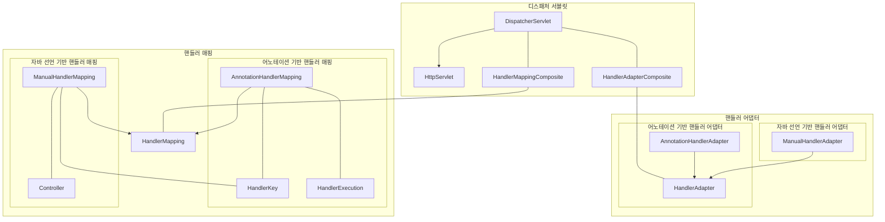
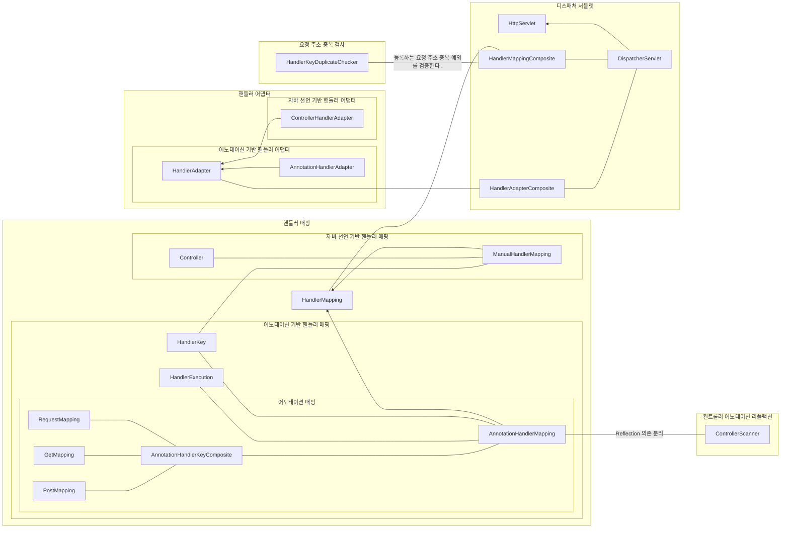

# @MVC 구현하기

## 1단계 미션

#### (HandlerKey) 핸들러 매핑을 위한 HandlerKey를 구현한다.

- [x] Request Uri 정보를 갖는다.
- [x] Request Http Method 정보를 갖는다.

#### (HandlerExecution) 메서드 정보를 가지고 있는 HandlerExecution을 구현한다.

- [x] HandlerExecution의 필드로 Object(Controller)를 선언한다.
- [x] HandlerExecution의 필드로 Method를 선언한다.
- [x] HandlerExecution의 handle 메서드를 통해 결과값(ModelAndView)를 반환하도록 기능을 구현한다.

#### (AnnotationHandlerMapping) Controller, RequestMapping 어노테이션이 선언된 클래스와 메서드 정보를 가져와 핸들러 매핑 정보로 저장한다.

- [x] Controller 어노테이션이 선언되어 있는 클래스를 가져온다.
- [x] RequestMapping 어노테이션이 선언되어 있는 메서드를 가져온다.
    - [x] RequestMapping이 가지고 있는 uri, method를 정보를 가져와 HandlerKey를 생성한다.
    - [x] RequestMapping 어노테이션이 선언된 메서드 정보를 가져와 HandlerExecution을 생성한다.
    - [x] HandlerKey와 HandlerExecution을 key-value로 매핑한다.
    - [x] 클라이언트 요청 정보를 가지고 있는 HttpServletRequest를 이용해서 HandlerKey를 생성한 후 매핑된 HandlerExecution을 찾아 반환한다.
- [x] HandlerKey에 매핑되는 HandlerExecution이 존재하지 않을 경우 null을 반환한다.

## 2단계 미션

#### 매핑 정보 찾기

- [x] HandlerMappingComposite을 통해서 요청에 맞는 컨트롤러 매핑 정보를 찾는다.
- [x] HandlerMapping에 요청에 맞는 메서드 매핑 정보를 찾는다.
- [x] HandleAdapterComposite을 통해서 요청에 맞는 HandlerAdapter를 찾아 로직을 수행한다.

#### 디스패처 서블릿

- [x] Annotation과 Manual의 정보가 공존할 수 있도록 하나의 디스패처 서블릿에 둘 수 있도록 한다.



```text
Annotation으로 찾은 매핑 정보와 Manual의 매핑 정보가 중복되어 서로 같은 매핑에 다른 로직을 수행하게 될 경우가 있다.
이럴 경우는 처음부터 하나의 매핑 정보가 있을 경우 다른 매핑 정보는 중복되지 않게 처리할 것인지 예외를 발생시킬지 같이 있을 수 있게 할지 고민이다.


```

<br>
<br>
<br>

### 2단계 미션 1차 피드백 반영

- [x] HandlerMappingComposite의 getHandlerMapping 반환값을 Optional로 래핑한다.
- [x] static final + 인스턴스 != 상수; 즉, 대문자로 선언된 필드명을 소문자로 수정한다.
- [x] 테스트 검증부 정렬하기
- [x] 스프링의 동일한 매핑 동작 참고,
- [x] Manual은 v1, Annotation은 v2 주소로 변경
- [x] GetMapping, PostMapping, RequestMapping
- [x] 중복되는 요청 주소가 있을 경우 예외를 발생시킨다.

### 2단계 힌트 훔쳐보기 😋

- [x] AnnotationHandlerMapping에서 외부 라이브러리인 Reflection 의존을 ControllerScanner 도입을 이용하여 끊는다.
- [x] ManaualHandlerAdapter 클래스명을 ControllerHandlerAdapter 로 변경한다.
- [x] Controller와 Annotation으로 구분하여 패키지를 분리한다.

```text
👨‍🚀 비교해봐요.

[HandlerMappingComposite과 HandlerMappingRegistry]

내가 구현한 HandlerMappongComposite은 힌트에 나온 HandlerMappingRegistry와 비슷하다.
네이밍의 차이인 듯 싶다.

Composite은 여러 요소를 조합해서 하나를 만드는 느낌이다.
Registry는 어떠한 정보를 등록한다는 의미로 다가온다.

여러 HandlerMapping을 조합해서 하나의 HandlerMapping를 만든다는 의미도 현재 상황에 맞고 
HandlerMapping 정보를 등록하여 사용하는 것도 의미가 현재 상황에 맞다고 느껴진다.

현재 상황에서 Registry라는 네이밍으로 수정한다고 해서 큰 차이가 없다고 생각해서 수정하지 않기로 한다. 🧑‍⚖️ 

---

[AnnoataionHandlerMapping에 Reflection 의존성 끊기]

AnnotationHandlerMapping 내부에 리플랙션 사용하는 부분을 ControllerScanner으로 분리한다.

HandlerMapping은 어떤 매핑 정보(HandlerKey)에 어떤 메서드 정보(HandlerExecution)을 갖고 매핑 정보에 맞는 메서드 정보를 전달하는 역할을 하고 있다.

하지만 AnnotationHandlerMapping 내부 로직을 보면 리플랙션을 통해서 메서드 정보 이전에 컨트롤러 정보를 모두 가져와서 진행하고 있는 것을 알 수 있다.

즉, 정보를 매핑하는 것뿐만 아니라 정보를 가져오는 역할까지 가지고 있고 이를 분리하기 위해서 ControllerScanner에게 컨트롤러 정보를 가져오는 역할을 넘긴거 같다.

ManualHandlerMapping을 보면 Controller를 직접 주입하는 것으로 보여 AnnotationHandlerMapping도 큰 문제 없어보인다.

하지만 AnnotationHandlerMapping에 `import org.reflections.Reflections;` 문이 있는 것을 확인할 수 있고 Reflection을 의존하지 않게 만들기 위해 ControllerScanner를 구현하기로 한다. 🧑‍⚖️

```



## 3단계 미션

- [x] JspView 클래스 구현
- [x] JsonView 클래스 구현
- [x] Legacy Mvc 제거
  - [x] 버전1 컨트롤러 (Manual 관련) 삭제
  - [x] 버전2 컨트롤러 클래스명 수정 및 url에 `/v2` 삭제
- [x] UserController 추가 후 동작 확인
- [x] HomeViewController 추가 
