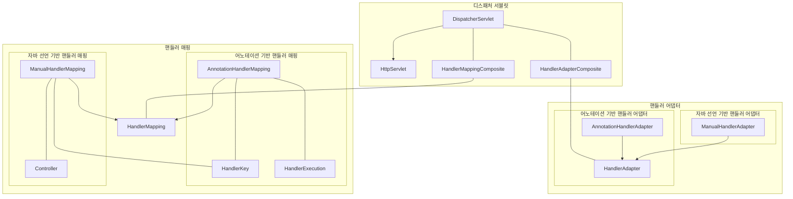

# @MVC 구현하기

### 1단계 미션

#### (HandlerKey) 핸들러 매핑을 위한 HandlerKey를 구현한다.
  - [x] Request Uri 정보를 갖는다.
  - [x] Request Http Method 정보를 갖는다.

#### (HandlerExecution) 메서드 정보를 가지고 있는 HandlerExecution을 구현한다.
  - [x] HandlerExecution의 필드로 Object(Controller)를 선언한다.
  - [x] HandlerExecution의 필드로 Method를 선언한다.
  - [x] HandlerExecution의 handle 메서드를 통해 결과값(ModelAndView)를 반환하도록 기능을 구현한다. 

#### (AnnotationHandlerMapping) Controller, RequestMapping 어노테이션이 선언된 클래스와 메서드 정보를 가져와 핸들러 매핑 정보로 저장한다.
  - [x] Controller 어노테이션이 선언되어 있는 클래스를 가져온다.
  - [x] RequestMapping 어노테이션이 선언되어 있는 메서드를 가져온다.
    - [x] RequestMapping이 가지고 있는 uri, method를 정보를 가져와 HandlerKey를 생성한다.
    - [x] RequestMapping 어노테이션이 선언된 메서드 정보를 가져와 HandlerExecution을 생성한다.
    - [x] HandlerKey와 HandlerExecution을 key-value로 매핑한다.
    - [x] 클라이언트 요청 정보를 가지고 있는 HttpServletRequest를 이용해서 HandlerKey를 생성한 후 매핑된 HandlerExecution을 찾아 반환한다.
  - [x] HandlerKey에 매핑되는 HandlerExecution이 존재하지 않을 경우 null을 반환한다.

### 2단계 미션

#### 매핑 정보 찾기
  - [x] HandlerMappingComposite을 통해서 요청에 맞는 컨트롤러 매핑 정보를 찾는다.
  - [x] HandlerMapping에 요청에 맞는 메서드 매핑 정보를 찾는다.
  - [x] HandleAdapterComposite을 통해서 요청에 맞는 HandlerAdapter를 찾아 로직을 수행한다.

#### 디스패처 서블릿
  - [x] Annotation과 Manual의 정보가 공존할 수 있도록 하나의 디스패처 서블릿에 둘 수 있도록 한다.




```text
Annotation으로 찾은 매핑 정보와 Manual의 매핑 정보가 중복되어 서로 같은 매핑에 다른 로직을 수행하게 될 경우가 있다.
이럴 경우는 처음부터 하나의 매핑 정보가 있을 경우 다른 매핑 정보는 중복되지 않게 처리할 것인지 예외를 발생시킬지 같이 있을 수 있게 할지 고민이다.


```
